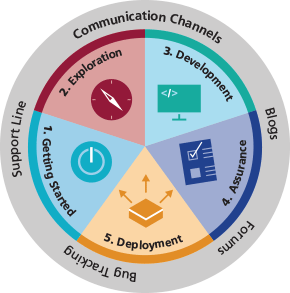



# Introduction #

The eRS Service Search APIs within this site have been developed by NHS Digital. These APIs aim to better support the delivery of care by opening up information and data stored by the Electronic Referral Service (eRS).

# Application Programming Interface (API) #

A key aspect of the NHS e-RS vision is to enable local innovation and adoption of paperless referrals. You can do this in a secure and controlled manner using our API. The APIs are a well-defined interface aiding new software solutions in a simple way.
We want to stimulate and assist your development of applications linked to the NHS e-RS via its API. We describe and provide the usual tasks and support documents you will need here.

# Ecosystem #

The site has five main parts. Each aligns to a phase of development and partner engagement with NHS Digital, as shown below. The Communication Channels let you engage with each phase of the Ecosystem. They are enabling components.

|Phase   | Description|
|----------|-----------|
| [Get Started](index.html) | Non-technical and high-level technical documentation to get started with the development|
| [Explore](explore.html)| First taste of API through an interactive online console with full API reference, type system, and (ReST) resource definitions|
| [Develop]()| Business processes, code samples, and system test environments|
| [Assure]()| NHS Digital validation, integration testing, technical accreditation, and guidance to clinical safety and information governance|
| [Deploy]()| Registration, deployment certificates and monitoring|
